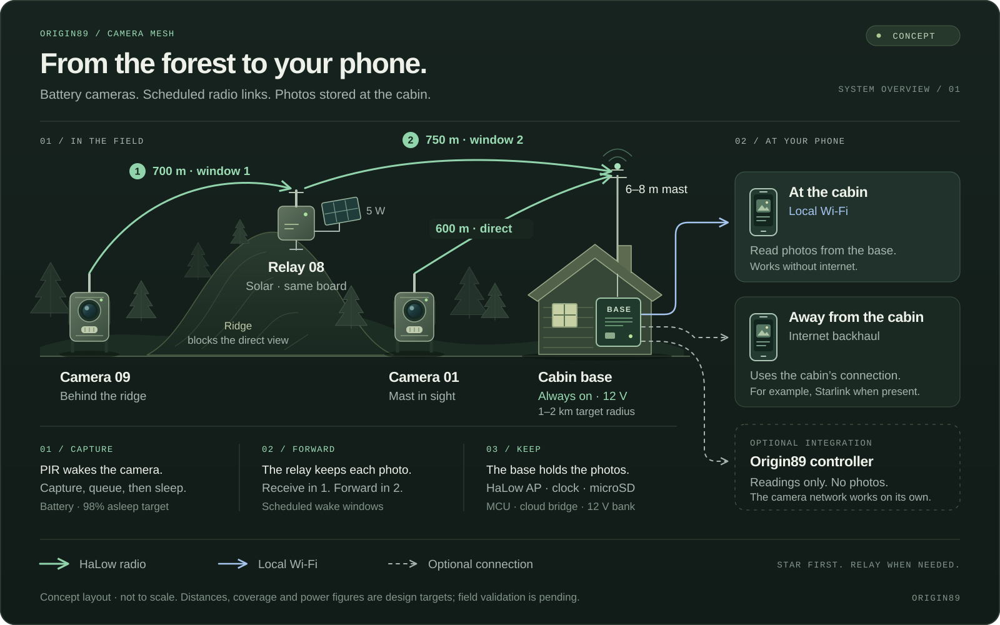
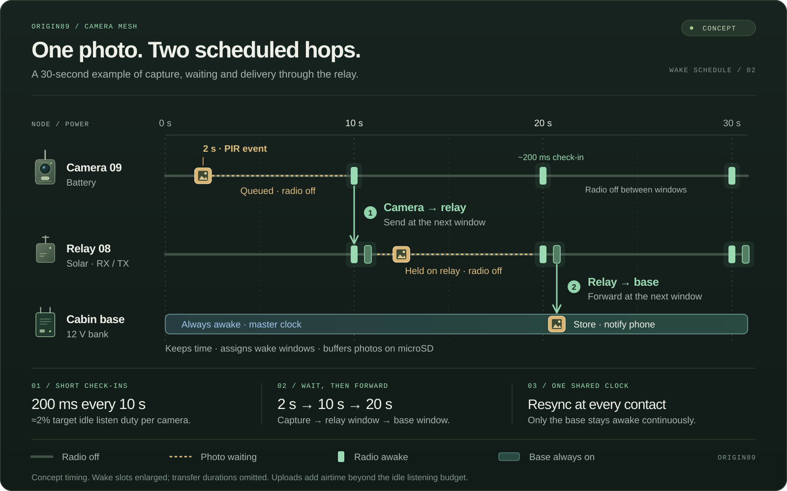

# Camera mesh: a sibling product

**Status: concept. Nothing here is measured yet.** This document exists so the
idea survives the conversation it was born in, in the house style: what fails
today, what the design prevents, and what has to be true before a board is
drawn. The gates on the board are measurements, not the calendar; they are
listed under "What must be true before a board is drawn". The controller's
first winter gates the *integration claims* and a combined sale, not this
board: the two products share a protocol and nothing else, which is what
lets them be built in parallel.

Working name: **the camera mesh**. A product name comes later.

---

## The one sentence

Trail cameras that talk to your cabin instead of a cell tower: no
subscription needed to work, working exactly where LTE does not, asleep all
winter, and the photos on your phone.

## What fails today

| What people buy | How it fails at km 43 |
|---|---|
| LTE trail cameras | Need a tower. The cabin has none. Monthly plan for a camera that cannot connect |
| Wi-Fi trail cameras | 2.4 GHz: 50–100 m through trees. You are standing next to it |
| SD-card cameras | Somebody drives out to read the card. The whole point of this company is that nobody drives out |

The gap is a radio that reaches the cabin and a schedule that lets everything
sleep, not a better camera.

---

## Three parts, one rule

*The camera behind the ridge goes through a solar relay; the one in sight of
the mast talks directly; the base keeps everything and hands it to the phone;
the controller only reads.*

**The rule:** the base needs nothing but 12 V and a place to stand. The
controller is an *option* it can plug into, never a dependency. A hunter with
no solar system installs the base, the cameras, and is done.

### Camera node

ESP32-P4 (MIPI camera interface, a hardware image processor, JPEG in
hardware, 12 µA asleep), a HaLow module, a PIR, a battery, an optional
palm-sized solar panel, IR illumination, an IP67 body with a glass window.
Sleeps at microamps. Wakes on the PIR, shoots, queues the JPEG on flash, and
goes back to sleep until its **wake window**, the only time its radio is on.

### Relay node

The same board with the camera unpopulated. Solar-powered because it holds
two windows instead of one (up and down). Store-and-forward: it receives in
one window, sends in the next. A relay is the exception, not the design (see
the topology section).

### Base

Sits in the cabin, powered by the bank (or a 12 V adapter where there is no
bank). HaLow access point on a high antenna, the master clock that hands
every node its schedule, and the same app protocol the controller already
speaks. A microcontroller, not a Linux box: the same class of part as
every other node, a microSD ring buffer instead of a disk, and a bridge to
the cloud over whatever internet the cabin has. The archive and the app live
on Cloudflare (R2, Workers, D1, Pages, the site's own stack); with no
backhaul, the phone reads the base's buffer over the base's own Wi-Fi.

A Linux single-board computer was the first draft, and it was a reflex, not
a decision. What it bought (a disk and a local app) the cloud buys for
nothing, and what it cost was real: 3–5 W continuous (~100 Wh a day) off the
bank the controller is guarding in January, a filesystem on an SD card that
the first power loss corrupts, and ~$150 instead of ~$40.

---

## Standalone by design, integrated by option

This is the question that decides the architecture.

| | Standalone | With a controller present |
|---|---|---|
| Power | 12 V in, its own fuse | The same bank. The base is a load the controller can shed under low state of charge, through a relay output it already has |
| Storage | MicroSD buffer at the base, the archive in R2 | The same. The controller never touches photos |
| App | The base is a device in the app | Same app, one more device on the site |
| Readings | Shown by the base | Node batteries, link health, photo counts flow to the controller as readings, like a charger's. They appear beside the bank's |
| Notifications | Through the base's own backhaul | Through the controller's existing cloud path; one pairing, one place |
| Failure of the other box | Not noticed | Not noticed. Coupling is data, never control |

Mechanically: the base is one entry in the controller's device catalogue
and one driver, the same `add-device` path every meter and charger took.
The controller does not learn anything about cameras; it learns that a device
reports battery percentages and a counter. That is the whole integration, and
it is why the two products cannot take each other down.

---

## Radio

**802.11ah (Wi-Fi HaLow).** 902–928 MHz, licence-exempt in Canada
(RSS-247) and the US (FCC 15.247). 1 or 2 MHz channels. Hundreds of kbps to a
few Mbps, which is a photo in seconds and a short clip in a minute.

Silicon: Morse Micro MM6108 (SPI/SDIO modules, Linux and RTOS SDKs) or
Newracom NRC7394. **Certified modules only**: no discrete RF on a product
that has to pass RSS-247 with a hunting-season deadline behind it. The choice
between the two is made after the range test, not before.

### Topology: star first, mesh where the terrain says so

The base's antenna goes up: a mast or a tree, 6–8 m. From there, 900 MHz
covers a 1–2 km radius over mixed forest and cutovers. Most cameras talk to
the base directly. Relays exist only for nodes behind a ridge or beyond the
radius, and the core of any layout is a loop, so one dead relay does not
orphan the far side.

On the property that prompted this document the sketch is nine nodes around
a base, hops of 500–750 m, a core loop, one 1 km link and one three-hop
tail. Three lessons from drawing it:

- **Elevation profile before distance.** At 900 MHz over 700 m the first
  Fresnel zone wants ~7–8 m of clearance at mid-path. A hill between two
  nodes kills a link that distance alone would allow. Check every link's
  profile in Google Earth before buying a single module.
- **A long link wants a Yagi, not a relay.** A 900 MHz Yagi is 40 cm and
  +10 dBi. It turns a marginal 1 km link into a solid one and costs less
  than a solar relay.
- **A tail of three relays is three single points of failure.** Acceptable
  for latency (see the schedule), questionable for reliability. Prefer a
  directional link that skips a hop.

### The schedule is the power budget

A mesh where relays stay awake needs mains. This one does not, because a
trail camera does not care about latency: a photo that arrives in five
minutes is a photo that arrived.

- The base holds the master clock and assigns every node a wake window
  through 802.11ah's Target Wake Time. Everything else sleeps.
- A node wakes for ~200 ms every ~10 s, exchanges what is queued, sleeps.
  A relay opens its downstream and upstream windows back to back.
- Latency = hops × period. Three hops at 10 s is half a minute.
- Clocks drift: a ±20 ppm crystal is 1.7 s/day. Guard time around each
  window, resync on every contact. A node that misses N windows falls back
  to a wide listen until it hears the base again. This is the fail-safe,
  and a test must fail loudly if it is ever removed.

*Thirty seconds of the schedule: nobody listens outside its window, the
photo advances one hop per window, and only the base pays for staying awake.*

At 2 % listen duty a HaLow module averages ~1 mA. The arithmetic below rests
on that number, which is a datasheet number until a multimeter says
otherwise, at room temperature and in a freezer.

---

## Power

| Node | Source | Budget | Why it holds |
|---|---|---|---|
| Camera, battery only | 4× AA lithium primary (L91) or LiFePO₄ 18650 | ~1 mA average + photo bursts → a season | Lithium primary works at −40 °C; LiFePO₄ does not charge below 0 °C, which is fine for a cell that is not being charged |
| Camera, solar | LiFePO₄ + 2 W panel | Indefinite in summer, a season in winter | Same charge-below-freezing rule the controller enforces on the bank. Reuse the frost logic, do not rewrite it |
| Relay | LiFePO₄ 6 Ah + 5 W panel | Survives January at ≤5 % duty | To be checked against the controller's own season simulator, which already models insolation at this latitude |
| Base | The cabin bank, or a 12 V adapter | ~0.3–0.5 W awake | It is the one node allowed to stay awake. Being a microcontroller with a HaLow module, staying awake costs a tenth of what a Linux board would take from the bank |

---

## Data

### Thumbnails first, because the radio is the battery

Sending a 300 KB photo over HaLow is ~5 s of transmit at ~300 mA, about
0.4 mAh. A windy day that trips the PIR two hundred times for waving
branches burns 80 mAh on nothing, against ~24 mAh for everything else the
camera does that day. False triggers are what empties a battery in
January, not an app annoyance. So the filter lives before the radio, and
the cloud does the rest:

- The camera always sends a **thumbnail** (~10 KB, thirty times cheaper).
  Full resolution stays on its card and travels only when asked for, by
  the cloud after classification or by a thumb in the app, through the
  next wake window. One extra window of latency for the full picture, and
  a thirty-fold cut in radio energy on everything that turns out empty.
- A small classifier on the ESP32-P4 (animal / person / vehicle / empty,
  a few hundred milliseconds on its two cores) gates what gets queued at
  all. It is tuned to never be silently wrong: unsure means send the
  thumbnail and let the cloud decide. A false negative is a lost moose; a
  false positive is 10 KB.
- In the cloud, Workers AI tags every thumbnail (species, person, vehicle,
  empty), and the app is built on those tags: "show me the bear", not
  "scroll 400 pictures of a spruce in the wind".

### Volumes

- The first sensor is a native 5 MP (2592×1944) on a MIPI module,
  the class the good trail cameras carry; the "33 MP" and
  "36 MP" on the boxes are interpolated in firmware. A full 5 MP JPEG is
  ~1 MB; the delivered "standard" picture is a 1600×1200 at 150–300 KB;
  the thumbnail is ~10 KB. A busy camera makes 50 triggers a day: 500 KB
  of thumbnails, a few standard pictures on request, the full frames on
  the card.
- What decides a trail picture is **trigger speed** (the market says
  0.2–0.5 s; a microcontroller waking and initialising the sensor is
  nearer 0.6–1 s unless the sensor idles in standby, which costs current;
  measured before the board, see below), **night** (the IR array, the
  pixel size and the image processor's noise handling, not resolution)
  and the **lens**, not megapixels. Night is why the node is an ESP32-P4 and
  not an ESP32-S3: the S3 has no MIPI receiver and no image processor, so
  a parallel-bus OV5640 delivers the ESP32-CAM class of picture; the P4
  puts a real ISP behind the same class of sensor, on the same sleep
  budget, and the camera module plugs into the Raspberry Pi connector so
  the sensor can change without the board changing. The reasoning and
  the costs are in [CAMERA-NODE.md](board/CAMERA-NODE.md).
- **Photo only, by decision.** A 10 s 720p clip is ~2 MB: thirty seconds
  of HaLow transmit and ten times a photo's energy to capture and encode,
  which is what the scheduled mesh and the battery table are built to
  avoid. Video is also what forces a dedicated camera SoC, a
  microphone and a clip pipeline into a trail camera. The first board
  shoots stills; a **burst** (three frames in a second, three times a
  photo's cost, no new silicon) answers the question video is usually
  bought for: what did it do. Video is a later revision's question,
  gated by demand, not by technique.
- **Three copies, by design, because the cabin's internet is optional.**
  The camera keeps its own on microSD (every trail camera has, forever),
  and it is the copy nothing can lose. The base holds a microSD ring
  buffer (a few GB is months) and drains it to R2 whenever the backhaul is
  up. R2 is the archive and what the app reads: 10 GB free, no egress fee,
  and a busy site makes 15 MB a day.

### Free and paid, without lying about "no subscription"

The product works with nothing paid: the camera's own card, the base's
buffer, and the latest N pictures per camera kept in R2. Paying buys months
of retention, the species tags and the alerts. R2 itself costs cents (a
busy camera is 15 MB a month of thumbnails), so the subscription is for the
app, the classification and the work, not for disk, and the pitch says "no
subscription needed", never "no subscription".
Free tier expiry is a ring, oldest first, and the camera's card still has
everything.

- **The link is IP.** HaLow is Wi-Fi; the nodes speak the existing site
  protocol over TCP: framing, auth and pairing already exist and are
  specified against the failures that matter. Nothing new on the wire.
- Remote: the app reads R2: thumbnails first, full resolution on tap.
  Off-grid with no backhaul, the phone reads the base's buffer over the
  base's own Wi-Fi when it is at the cabin: same app, local mode.

---

## What goes wrong, and what catches it

| Failure | What the design does |
|---|---|
| A node's battery dies in January | The base shows last-seen and a battery trend for every node; the core loop routes around a dead relay |
| Clock drift closes a window | Guard time, resync on contact, wide-listen fallback after N misses |
| A relay spends its budget forwarding for others | Per-node energy accounting at the base; the app shows who is carrying whom |
| A moose relocates a camera | Missed-windows alert with last-known position |
| Wind trips the PIR three hundred times a day | The on-camera classifier drops the obvious empties before the radio; the rest go as 10 KB thumbnails; the cloud tags them; the full pictures never leave the card unless asked |
| The classifier is wrong | It is biased to send: unsure means thumbnail. The card keeps every full frame, so a miss in the cloud's view is recoverable on the next visit or on request |
| Another 915 MHz radio on the property (LoRa, Meshtastic) | Channel scan at install; HaLow's channel plan leaves room |
| The cabin has no internet, or Starlink is off for the winter | Nothing is lost: the camera's own card has it, the base's buffer has months, and the app reads the base locally. R2 catches up when the link returns |
| Base buffer fills before the link returns | Ring buffer, oldest first; the camera's card still has everything |
| A firmware update bricks a node 700 m into the woods | A/B slots on every node, updates ride the same windows slowly, and **no over-the-air update until a bootloader exists and an image has been verified on a bench**; the controller's rule, unchanged |
| The controller is removed | Nothing. The base never depended on it |

---

## What an LTE trail camera looks like inside

A teardown of one of the mass-market LTE cameras, its main board already on
a fourth revision, which is its own lesson, confirms the shape and corrected
two lines of the table below:

- The image sensor sits on the main board behind a screwed lens holder,
  with a **mechanical IR-cut filter** beside it. Without the filter a
  camera is pink by day or blind by night. It was missing from the first
  draft of this document.
- The PIR is a large pyroelectric can behind a Fresnel lens in the
  housing, 25–30 m of detection. A hobby PIR module sees three metres.
- The IR flash driver is a separate front board in the cover: boost
  converter, 0.68 Ω sense shunt, a MOSFET per LED string, fed over an FFC.
  High current lives next to the LEDs, not across a cable. One board is
  possible if the enclosure puts LEDs and board on the same face.
- The SoC is a dedicated camera part with an ISP and H.264, which is why
  its video is decent, and a large part of why the camera costs and
  draws what it does. Stills do not need it; this product ships stills.
- An LTE module under a shield, a coax to a wire antenna, a microphone,
  a debug header, eight test points. The radio and the microphone go
  away with the video; the test points are a habit worth stealing.

## Rough bill of materials

| | Parts | Order of cost |
|---|---|---|
| Camera node | ESP32-P4 with its flash and core buck (photo only by decision, though the encoder for video is on the chip), a MIPI camera module on the Raspberry Pi 15-pin connector (OV5647 NoIR first) behind a screwed lens holder, **mechanical IR-cut filter** with its H-bridge (colour by day, IR by night), HaLow module (~$20), a **real pyroelectric PIR** (Excelitas/Murata class) behind a Fresnel lens tuned to the field of view (not a hobby module), LiFePO₄ or 4×AA, small MPPT charger (CN3791/BQ25185), 8–12 850 nm IR LEDs on a **boost driver with a current-sense shunt**, IP67 body with glass | $60–80 |
| Relay node | Same PCB, camera unpopulated, 5 W panel, 6 Ah LiFePO₄ | ~$40 + panel and cell |
| Base | The same board with the HaLow module in access-point mode, microSD, and an ESP32-C6 module fitted for the Wi-Fi uplink to the cabin's internet (the P4 has no radio of its own), a box in the family's shape and faceplate grammar | ~$45 |

---

## What must be true before a board is drawn

Conditions, in order. Each one is a measurement, not a meeting.

1. **The range test on the actual property.** Two development modules, the
   base position and the first two hops of the sketch. Pass: usable
   throughput at both points with more than 10 dB of margin, through the
   trees that are actually there.
2. **Sleep current of the chosen module**, measured, at room temperature and
   in a freezer. The whole power table above is a datasheet claim until then.
3. **Access-point mode, TWT scheduling and relay chaining work on a
   microcontroller host, without Linux.** This is the choice between the
   two chip vendors: the Newracom NRC7394 is a standalone SoC that runs an
   access point in its own SDK; the Morse Micro MM6108 has an MCU SDK, but
   its access point has classically lived in hostapd on Linux. If neither
   does it, the fallback is application-level store-and-forward with the
   module alternating between station and access point; decide which
   before designing the relay's power budget or the base.
4. **One photo, two hops, end to end**, with latency and millijoules per
   photo measured. That number sizes every battery in the table.
5. **Trigger speed from deep sleep**, PIR edge to first frame captured,
   with the sensor cold and with it idling in standby, and the standby
   current that buys. Under half a second is the market; the trade is
   decided on the numbers.

Then: a base on a development kit, two development nodes in the field, and
a board.

None of this waits on the controller. The product is independent of it, and
the five measurements fit inside the weeks the controller's boards spend at
the fab.

What the controller's first winter *does* gate is narrower: the integration
claims (shedding the base under low state of charge, notifications through
the controller's cloud path) and any combined sale. The camera mesh borrows
the controller's protocol, frost logic and season simulator (all of which
run and are tested on a host today) and a camera node in the field is a
second proving ground for them, not a consumer waiting on the first.

---

## Relationship to the family

Same identity: the wordmark, the km 43 badge, the faceplate grammar, the
app. Same wall, same bank, same box shape. A different job: the controller
keeps a site alive; this one tells you what walked past. They share a
protocol and nothing else, which is what lets each be sold without the other.
